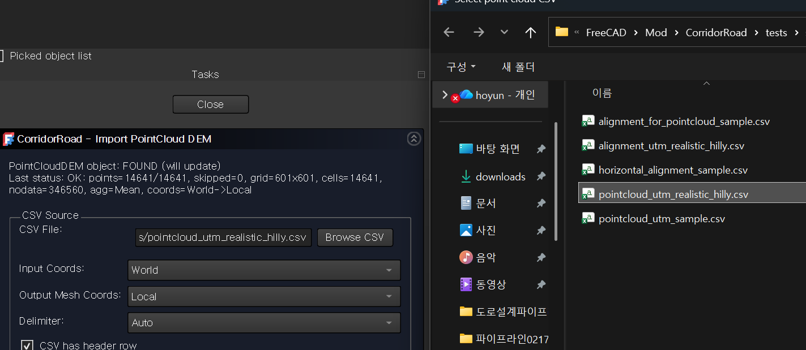
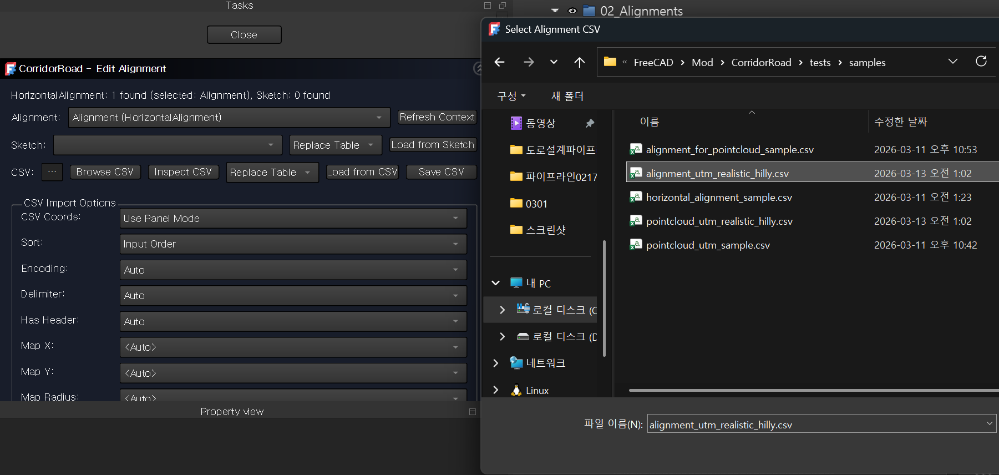

# CSV Format

This page defines CSV input format for point cloud, alignment, and structure import.

## File Encoding and Delimiter
- Recommended encoding: UTF-8
- Delimiter: comma (`,`)
- Decimal separator: dot (`.`)
- Keep one header row at top
- Avoid empty header names

## 1. Point Cloud CSV (DEM Source)

Required header:
`easting,northing,elevation`

Example:
```csv
easting,northing,elevation
352000.000,4169000.000,116.000
352005.000,4169000.000,116.021
352010.000,4169000.000,116.041
```

Rules:
- `easting`: float (X)
- `northing`: float (Y)
- `elevation`: float (Z)
- Recommended regular XY sampling for stable DEM mesh generation
- UTM coordinates are supported
- Keep enough density for mesh continuity in design area

Recommended sample file:
- `tests/samples/pointcloud_utm_realistic_hilly.csv`



## 2. Alignment CSV

Required header:
`E,N,Radius,TransitionLs`

Example:
```csv
E,N,Radius,TransitionLs
352060.000,4169055.000,0.0,0.0
352130.000,4169125.000,180.0,30.0
352210.000,4169200.000,220.0,35.0
```

Rules:
- `E`: float (IP easting)
- `N`: float (IP northing)
- `Radius`: float (`0` for tangent/no curve)
- `TransitionLs`: float (`0` allowed)
- At least 2 valid rows are required
- Keep alignment extents inside terrain extents for EG sampling stability

Recommended sample file:
- `tests/samples/alignment_utm_realistic_hilly.csv`



## 3. Structure CSV

Recommended header:
`Id,Type,StartStation,EndStation,CenterStation,Side,Offset,Width,Height,BottomElevation,Cover,RotationDeg,BehaviorMode,GeometryMode,TemplateName,WallThickness,FootingWidth,FootingThickness,CapHeight,CellCount,CorridorMode,CorridorMargin,Notes,ShapeSourcePath,ScaleFactor,PlacementMode,UseSourceBaseAsBottom`

Example:
```csv
Id,Type,StartStation,EndStation,CenterStation,Side,Offset,Width,Height,BottomElevation,Cover,RotationDeg,BehaviorMode,GeometryMode,TemplateName,WallThickness,FootingWidth,FootingThickness,CapHeight,CellCount,CorridorMode,CorridorMargin,Notes,ShapeSourcePath,ScaleFactor,PlacementMode,UseSourceBaseAsBottom
CULV-T01,culvert,120.000,150.000,135.000,center,0.000,6.000,2.500,103.200,1.200,0.000,section_overlay,template,box_culvert,0.350,0.000,0.000,0.200,2,notch,0.000,Two-cell box culvert template,,1.000,,
RW-T01,retaining_wall,265.000,340.000,302.500,right,8.000,0.600,4.000,101.800,0.000,0.000,assembly_override,template,retaining_wall,0.450,3.200,0.500,0.150,1,split_only,0.000,Right-side retaining wall template,,1.000,,
EXT-CULV-01,culvert,120.000,150.000,135.000,center,0.000,6.000,2.500,103.200,0.000,0.000,section_overlay,external_shape,,0.000,0.000,0.000,0.000,1,notch,0.000,Replace with your local STEP file,C:/replace-with-your-models/culvert_box.step,1.000,center_on_station,true
EXT-ABUT-01,abutment_zone,470.000,515.000,492.500,both,0.000,14.000,5.000,103.800,0.000,0.000,assembly_override,external_shape,,0.000,0.000,0.000,0.000,1,skip_zone,0.000,Replace with your local FCStd object path,C:/replace-with-your-models/bridge_parts.FCStd#AbutmentBlock,1.000,center_on_station,true
```

Rules:
- `Id`: recommended string identifier
- `Type`: one of `crossing`, `culvert`, `retaining_wall`, `bridge_zone`, `abutment_zone`, `other`
- `StartStation`, `EndStation`, `CenterStation`: numeric station values
- `Side`: one of `left`, `right`, `center`, `both`
- `Width`, `Height`: non-negative numeric values
- `BehaviorMode`: one of `tag_only`, `section_overlay`, `assembly_override`
- `GeometryMode`: one of `box`, `template`, `external_shape`
- `TemplateName`: currently `box_culvert`, `utility_crossing`, `retaining_wall`, `abutment_block`
- `WallThickness`, `FootingWidth`, `FootingThickness`, `CapHeight`, `CellCount`: template-specific fields
- `CorridorMode`: one of `none`, `split_only`, `skip_zone`, `notch`
- `CorridorMargin`: optional non-negative corridor envelope margin
- `Notes`: optional free text
- `ShapeSourcePath`: local `.step`, `.brep`, or `.FCStd#ObjectName` source path when `GeometryMode=external_shape`
- `ScaleFactor`: optional uniform scale for external geometry
- `PlacementMode`: currently `center_on_station` or `start_on_station`
- `UseSourceBaseAsBottom`: `true`/`false` flag for external source Z anchoring

Recommended sample file:
- `tests/samples/structure_utm_realistic_hilly.csv`
- `tests/samples/structure_utm_realistic_hilly_template.csv`
- `tests/samples/structure_utm_realistic_hilly_external_shape.csv`

Practical notes:
1. Run `Generate Stations` before using `Edit Structures`, even if the CSV contains valid station values.
2. `culvert`, `crossing`, `bridge_zone`, and `abutment_zone` are usually zone-type records that affect both section sides.
3. `retaining_wall` usually makes sense on only one side.
4. `tag_only` is the safest mode when you want structure-aware station tags without changing section behavior.
5. Leave `GeometryMode` empty if you want strict backward-compatible `box` behavior.
6. Use `template / box_culvert` when you want culvert display solids and `Structure Sections` overlays to show wall and cell layout.
7. Use `template / retaining_wall` when you want footing + stem display and overlay shapes.
8. Use `external_shape` when you already have a structure model in `STEP`, `BREP`, or `FCStd` format and want to place that geometry directly.
9. For `FCStd`, use `ShapeSourcePath` in the form `C:/path/model.FCStd#ObjectName`.
10. The repository does not currently bundle sample `.step`, `.brep`, or `.FCStd` files, so the sample `ShapeSourcePath` values are placeholders that must be replaced before use.

> [Screenshot Needed] Edit Structures panel loading a structure CSV file.
> Suggested file: `wiki-csv-structure-import-panel.png`

## 3A. Structure Station-Profile CSV

This is an advanced companion CSV format for variable-size structures.

Important note:
- The current `Edit Structures` task panel edits the base structure header rows only.
- It does not yet provide a dedicated grid or direct CSV loader for station-profile control points.
- The sample station-profile CSVs are reference data for property-driven, scripted, or future importer-based workflows.

Recommended header:
`StructureId,Station,Offset,Width,Height,BottomElevation,Cover,WallThickness,FootingWidth,FootingThickness,CapHeight,CellCount`

Example:
```csv
StructureId,Station,Offset,Width,Height,BottomElevation,Cover,WallThickness,FootingWidth,FootingThickness,CapHeight,CellCount
CULV-V01,120.000,0.000,4.000,2.000,103.300,0.000,0.280,0.000,0.000,0.050,1
CULV-V01,150.000,0.000,6.000,2.600,103.100,0.000,0.320,0.000,0.000,0.120,2
CULV-V01,180.000,0.000,3.800,1.900,102.950,0.000,0.260,0.000,0.000,0.050,1
RW-V01,265.000,7.500,0.550,2.800,101.900,0.000,0.320,2.200,0.450,0.120,1
RW-V01,305.000,8.250,0.700,5.000,101.650,0.000,0.420,3.000,0.600,0.220,1
RW-V01,345.000,9.000,0.600,3.400,101.450,0.000,0.360,2.400,0.500,0.120,1
```

How it is used:
1. Each `StructureId` must match a row in the main structure CSV.
2. At least two profile points are recommended for a variable structure.
3. Profile rows for the same structure should be in ascending station order.
4. Duplicate stations for the same structure should be avoided.

Current runtime consumption:
1. 3D structure display uses station-profile values.
2. `Structure Sections` overlay objects use station-profile values.
3. Section overrides and earthwork use station-profile values.
4. Corridor `notch` handling uses station-profile values.

Current limits:
1. `CellCount` is treated as a step/nearest value, not a continuously interpolated value.
2. `skip_zone` and `split_only` still follow the base structure span (`StartStation`/`EndStation`) rather than profile-point-derived span changes.
3. The current runtime builds variable structures as profile-driven segments, not as a fully continuous taper loft.

Recommended sample files:
- `tests/samples/structure_utm_realistic_hilly_station_profile_headers.csv`
- `tests/samples/structure_utm_realistic_hilly_station_profile_points.csv`
- `tests/samples/structure_utm_realistic_hilly_mixed.csv`
- `tests/samples/structure_utm_realistic_hilly_mixed_profile_points.csv`

> [Screenshot Needed] Structure Sections overlays showing station-profile-driven size changes.
> Suggested file: `wiki-csv-structure-station-profile-overlays.png`

## 4. Import Validation Checklist
1. Header names match exactly.
2. Numeric fields are finite values.
3. Alignment lies within point cloud spatial extent.
4. Coordinate mode (`Local`/`World`) is consistent for terrain usage.
5. Structure station ranges fall inside the generated alignment/stationing range.

## 5. Common Data Issues
- Sparse point cloud causes holes or no-data cells.
- Alignment outside terrain extent causes EG blanks.
- Non-numeric text in numeric columns causes row skips.
- Mixed coordinate frames (local/world mismatch) produce shifted results.
- Structure CSV with invalid `Type`, `Side`, or `BehaviorMode` causes validation warnings.

## 6. DEM Cell Size Tuning

`CellSize` controls how the imported point cloud is sampled into the DEM grid.

How to interpret it:
- Smaller `CellSize` preserves more local terrain detail.
- Smaller `CellSize` also makes sparse areas more visible, which can leave holes or weak coverage in the DEM.
- Larger `CellSize` averages over a wider area and can reduce no-data gaps in sparse point clouds.
- Larger `CellSize` can help reduce blank or zero EG/profile values when the source point cloud is not dense enough.

When to increase `CellSize`:
1. EG values are blank at many stations.
2. Profile data contains long zero-value runs after DEM import.
3. The terrain mesh looks fragmented or contains many small holes.
4. Point spacing in the CSV is visibly wider than the current DEM cell size.

Tradeoff:
1. If `CellSize` is too small, terrain detail is preserved but coverage may be unstable.
2. If `CellSize` is too large, EG/profile coverage may improve, but the terrain becomes smoother and sharp features may be flattened.

Recommended tuning approach:
1. Start near the typical XY point spacing of the source CSV.
2. If EG/profile values contain many blanks or zeros, increase `CellSize` gradually.
3. Rebuild the terrain and regenerate profiles after each change.
4. Stop when coverage becomes stable without excessively flattening the terrain.

Practical note:
- If your point cloud spacing is irregular, it is usually safer to use a slightly larger `CellSize` than the smallest local spacing.
- For early testing, stable EG coverage is often more important than preserving every small terrain variation.

> [Screenshot Needed] PointCloud DEM task panel showing `CellSize` adjustment.
> Suggested file: `wiki-csv-dem-cellsize-tuning.png`

---
Last verified with commit: `<fill-after-release>`
