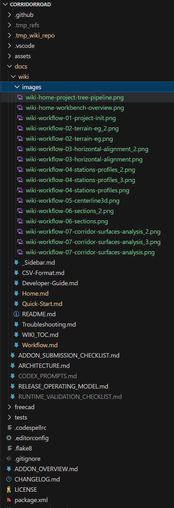

<!-- SPDX-License-Identifier: LGPL-2.1-or-later -->
<!-- SPDX-FileNotice: Part of the Corridor Road addon. -->

# Developer Guide

This page is the quick technical map for contributors.

## Code Layout
- `freecad/Corridor_Road/init_gui.py`
- `freecad/Corridor_Road/commands/`
- `freecad/Corridor_Road/objects/`
- `freecad/Corridor_Road/ui/`

## Key Runtime Policy
- Terrain/design/cut-fill runtime uses DEM-style regular XY grid sampling.
- Daylight terrain source in section generation is mesh based.
- Coordinate handling uses project-level local/world transform policy.
- 3D centerline wire is a display object; station-based design logic must not treat its visible wire as the engineering source of truth.
- `HorizontalAlignment` transition curves now prefer BSpline source edges, while `Centerline3DDisplay` defaults to `SmoothSpline` for viewer-facing wire output.
- If the 3D centerline still looks zig-zag or slightly wiggly during zoom/pan, treat that as a display/rendering symptom first, then inspect source/display diagnostics such as `TransitionGeometryMode`, `EdgeTypeSummary`, `DisplayWireMode`, and `ActiveWireDisplayMode`.

## Main Objects
- `HorizontalAlignment`: horizontal geometry + key stations
- `Stationing`: station list generation
- `ProfileBundle` / `VerticalAlignment`: EG/FG data and vertical geometry
- `Centerline3DDisplay`: viewer-facing centerline rendering
- `RegionPlan`: alignment-owned region authoring model with grouped `Base Regions`, `Overrides`, and `Hints`
- `SectionSet`: station resolve + section generation + daylight
- `Corridor`: corridor surface generation from sections
- `DesignTerrain` / `CutFillCalc`: grid sampling based terrain/analysis

Object link chain (typical):
`HorizontalAlignment -> Stationing -> ProfileBundle/VerticalAlignment -> Centerline3DDisplay -> RegionPlan -> SectionSet -> Corridor -> DesignTerrain/CutFillCalc`

## Corridor Stability Notes
- `SectionSet` keeps section frame continuity using previous normal direction.
- Daylight side-width changes are smoothed by `AssemblyTemplate.DaylightMaxWidthDelta`.
- `CorridorLoft.AutoFixSectionOrientation` tries to reverse section point order only when neighboring-section comparison strongly suggests a left/right flip.
- `CorridorLoft.AutoFixedSectionCount` reports how many sections were auto-corrected during build.
- If the full corridor build still fails, adaptive segmented fallback is used and failed ranges are recorded in status.

Role split:
- `DesignGradingSurface` is the section-faithful reference mesh. It connects neighboring section points directly and is the easiest object to compare against generated section lines.
- `CorridorLoft` is the current internal compatibility name for the range-aware `Part` result. It should still follow the same section contract, but it also has to preserve corridor span meaning such as `split_only`, `skip_zone`, and notch-aware structure handling.
- If the two outputs disagree visually, first confirm whether the issue is true section-contract drift or a corridor-span/range behavior difference.

Quick comparison:
- `CorridorLoft`: keep corridor span meaning and downstream `Part` shape identity.
- `DesignGradingSurface`: show the most section-faithful strip-style reference surface.

Connectivity strategy:
- legacy `loft` behavior means handing section wires to a loft engine and letting it infer point correspondence
- preferred section-strip behavior means consuming the ordered points from `SectionSet` and connecting adjacent stations point-to-point
- `CorridorLoft` should add corridor span packaging on top of that section contract, not replace it with a different connectivity rule

Practical debugging order:
1. Inspect section wires before inspecting corridor output.
2. Reduce section density before changing corridor connectivity strategy.
3. Separate base corridor issues from daylight-induced issues.
4. Use ruled surface during diagnosis, then relax settings if stable.

## UI Entry Points
- `cmd_new_project.py`
- `cmd_edit_alignment.py`
- `cmd_generate_stations.py`
- `cmd_generate_centerline3d.py`
- `cmd_generate_sections.py`
- `cmd_generate_corridor.py`
- `cmd_import_pointcloud_dem.py`

Command-id note:
- Preferred command id is `CorridorRoad_GenerateCorridor`.
- Preferred command module path is `cmd_generate_corridor.py`.
- Legacy alias `CorridorRoad_GenerateCorridorLoft` is retired.
- Project hidden link property is now `Corridor`; new code should prefer corridor helper functions instead of reading that property name directly.
- Proxy/module names such as `CorridorLoft` also remain internal compatibility names for this cycle; do not start broad internal renames while geometry migration is still active.

Compatibility window:
- Proxy/module/type names such as `CorridorLoft` stay only while FCStd proxy restore and virtual-path alias mapping still rely on them. Remove them only after restore/recompute smokes prove the renamed path is stable.
- Generated child objects still use `ParentCorridorLoft` as the compatibility ownership link. New code should reference the compatibility constant instead of spelling that property name directly.
- New code should use corridor helpers such as `resolve_project_corridor()` and `assign_project_corridor()` instead of reading compatibility names directly.
- Recompute routing and task-panel corridor creation should also use `corridor_compat.py` constants instead of raw `CorridorLoft` literals.
- The retired command id `CorridorRoad_GenerateCorridorLoft` should not appear in runtime wiring anymore.
- The retired task-panel path/class (`task_corridor_loft.py`, `CorridorLoftTaskPanel`) should not appear in runtime imports anymore.
- The canonical hidden project link property is `Corridor`; normal runtime code should still go through `assign_project_corridor()` and `resolve_project_corridor()`.
- The child ownership link `ParentCorridorLoft` should remain only in the corridor ownership-recovery boundary; normal runtime code should not spell or route around that compatibility path elsewhere.
- The proxy/type/name-prefix compatibility (`CorridorLoft`, `obj_corridor_loft.py`) should remain only in the FCStd restore and corridor-routing boundary until proxy retirement is explicitly opened.
- Preferred task-panel class path is `CorridorTaskPanel`.
- Preferred task-panel module path is `task_corridor.py`.
- Compatibility checks currently rely on `smoke_corridor_compat_aliases.py`, `smoke_corridor_child_link_boundary.py`, `smoke_corridor_command_alias_boundary.py`, `smoke_corridor_project_link_boundary.py`, `smoke_corridor_proxy_boundary.py`, `smoke_corridor_taskpanel_alias_boundary.py`, `smoke_corridor_fcstd_restore.py`, and `smoke_tree_schema.py`.
- Use `tests/regression/run_loft_retirement_gate_smokes.ps1` to rerun the full Loft-retirement gate set before opening any real alias-removal PR.

## Completion Message Policy
- Stations, 3D Centerline, Sections, and Corridor commands should show completion dialogs on successful run.
- Keep error behavior separate: warnings/errors should not show success dialogs.
- Include simple runtime summary in dialog where possible (count/status).

## Task-Panel Consistency Notes
- `Edit Profiles` currently uses a two-row table-action layout to keep long button labels readable.
- `Edit Profiles` top row is station/table oriented:
  - `Add Row`, `Remove Row`, `Sort by Station`, `Fill Stations from Stationing`
- `Edit Profiles` bottom row is FG/manual-entry oriented:
  - `Fill FG from VerticalAlignment`, `Import FG CSV`, `FG Wizard`
- Manual FG helpers must ask before leaving `FG from VerticalAlignment` mode.
- Headless-safe object creation matters for regression scripts:
  - only attach a `ViewProvider` when `ViewObject` exists
- `Edit PVI` should explain PVI semantics inline instead of assuming road-design terminology:
  - `PVI Station` = grade-break station
  - `PVI Elev` = FG elevation at that station
  - `Vertical Curve L` = total symmetric curve length centered on that PVI
- `Edit PVI` should auto-seed a starter vertical alignment when no saved VA exists and station/profile context is available.
- `Edit PVI` should provide:
  - `Load Starter PVI`
  - `Clear to Blank`
- `Edit PVI` should show a live under-table summary for first grades and curve windows so users can sanity-check inputs before `Generate FG Now`.
- `Generate Sections` bench editing now uses one table per side:
  - `Drop`, `Width`, `Slope`, `Post-Slope`
  - internal runtime should treat `LeftBenchRows` / `RightBenchRows` as the primary bench contract
  - legacy single-bench properties remain as compatibility shadow values only
- `Cross Section Viewer` should consume station-local `SectionComponentSegmentRows` as the source of truth for component annotations.
- `Cross Section Viewer` component rows should preserve `scope`:
  - `typical`
  - `side_slope`
  - daylight remains a dedicated marker/label path
- `Cross Section Viewer` component annotations currently follow this policy:
  - label and value stay in the same vertical column
  - value is placed after label using label-height-based clearance
  - component label/value rows do not use summary fallback
- `Cross Section Viewer` task-panel layout currently keeps:
  - `Use Selected Section` and `Refresh Context` on the row directly below `Section Set`
  - `Station` selector at the bottom of the `Source` group
  - no user-facing `Show labels` toggle
- `3D Centerline` task panel currently keeps:
  - command title/user intent focused on display generation, not design regeneration
  - optional `RegionPlan` / `StructureSet` source pickers
  - `Wire Display Mode` with `SmoothSpline` as the default user-facing mode and `Polyline` retained for debugging
  - semantic split toggles for region/structure boundaries and transitions
  - boundary-marker child objects under the main centerline object instead of turning the main wire into explicit tree-level segment objects
  - optional endpoint markers for explicit start/end review
  - no user-facing sampling or chord-error tuning; internal display-point generation now stays behind the task-panel UX
  - preferred runtime/result naming is now `Display*`; older `Sampled*` / `Sampling*` compatibility shadows have been removed from `Centerline3DDisplay`
  - property view should also hide raw display-point arrays and internal segmentation row payloads
  - completion/status text explicitly stating that station-based frames remain the engineering source of truth
  - source/display diagnostics kept distinct so users can tell whether jaggedness comes from source transition geometry or display wire mode
- `Typical Section` editor currently keeps:
  - `Shape` active only on `ditch` rows; non-ditch rows keep it blank and disabled
  - manual 3D preview via `Refresh Preview`; row edits do not auto-preview
  - full preview wire visible together with `SelectedComponentPreview` for the selected component row

## 3D Centerline Confidence Note
- `Centerline3DDisplay` is a viewer-facing wire and is not the engineering source of truth.
- `HorizontalAlignment` transition spirals now prefer fitted BSpline source edges; `Centerline3DDisplay` adds an independent display-layer `SmoothSpline` / `Polyline` choice on top of that source.
- `Polyline` remains a supported debug/display comparison mode; cleanup work on 3D centerline UX must not remove it.
- `SectionSet`, structure frame placement, and corridor generation continue to evaluate the alignment/profile model at stations rather than inheriting geometric truth from the visible wire.
- A visibly segmented 3D centerline can still make the model look less trustworthy to users even when the station-based calculations are correct.
- Preferred debugging order is:
  - inspect source diagnostics (`TransitionGeometryMode`, `EdgeTypeSummary`)
  - inspect display diagnostics (`DisplayWireMode`, `ActiveWireDisplayMode`)
  - only then inspect internal display-point density if debugging really requires it
- Region/structure semantic segmentation may intentionally increase visible wire splits while still preserving the same station-based engineering numbers downstream.
  - pavement preview/report object label as `PavementDisplay`
  - click-locked component-row activation; hover should not change the active row
- `Manage Regions` currently keeps:
  - `Workflow` as the main editing surface with grouped `Base Regions`, `Overrides`, and `Hints`
  - `Advanced` as a flat runtime preview/export surface for existing plans
  - direct flat-row editing available only while creating a new `RegionPlan`
  - `Seed From Project` creating managed hints first; hints do not silently become confirmed design rows
  - `Station Timeline`, `Base Regions`, `Overrides`, and `Hints` row tinting palette-aware so FreeCAD light and dark themes keep readable foreground/background contrast
  - region runtime compatibility expressed through `RegionPlan` export only; the old `RegionSet` path is retired

## Test Samples
- Point cloud: `tests/samples/pointcloud_utm_realistic_hilly.csv`
- Alignment: `tests/samples/alignment_utm_realistic_hilly.csv`
- Maintained practical sample inventory: `docs/PRACTICAL_SAMPLE_SET.md`
- Maintained practical regression runner: `tests/regression/run_practical_scope_smokes.ps1`
- Practical starter structure CSVs:
  - `tests/samples/structure_utm_realistic_hilly.csv`
  - `tests/samples/structure_utm_realistic_hilly_notch.csv`
  - `tests/samples/structure_utm_realistic_hilly_template.csv`
  - `tests/samples/structure_utm_realistic_hilly_external_shape.csv`

## Documentation Update Policy
1. If command behavior changes, update `README.md` and related wiki page together.
2. If CSV schema changes, update `CSV-Format.md` and sample files together.
3. Add `Last verified with commit` to changed wiki pages.
4. Keep `docs/PRACTICAL_SAMPLE_SET.md` synchronized with any sample-file additions or removals.
5. Keep `run_practical_scope_smokes.ps1` synchronized with the practical-engineering scope.
6. When task-panel color or tint behavior changes, verify readability in both FreeCAD light and dark themes and update the related wiki page if user-visible contrast rules changed.

## Recommended Contribution Flow
1. Reproduce issue using sample files.
2. Patch command/object/ui with minimal scope.
3. Verify with real command flow in FreeCAD.
4. Update docs/wiki draft pages under `docs/wiki`.
5. Sync approved pages to GitHub Wiki repo.

## Current Long-Term Scope Notes
1. The focused long-term track is `Expand practical engineering scope`.
2. Current scope includes practical subassembly contracts, report contracts, sample-driven validation, and surface-comparison review outputs.
3. `boolean_cut` work is intentionally excluded from the current long-term practical scope.
4. release-readiness / packaging work is also intentionally excluded from that current long-term scope.

## Debug Checklist For Field Issues
1. Capture command click path and timestamp.
2. Save report view/log message text.
3. Capture source object status fields before and after recompute.
4. Attach minimal CSV reproducer when possible.

---
Last verified with commit: `5174237`
