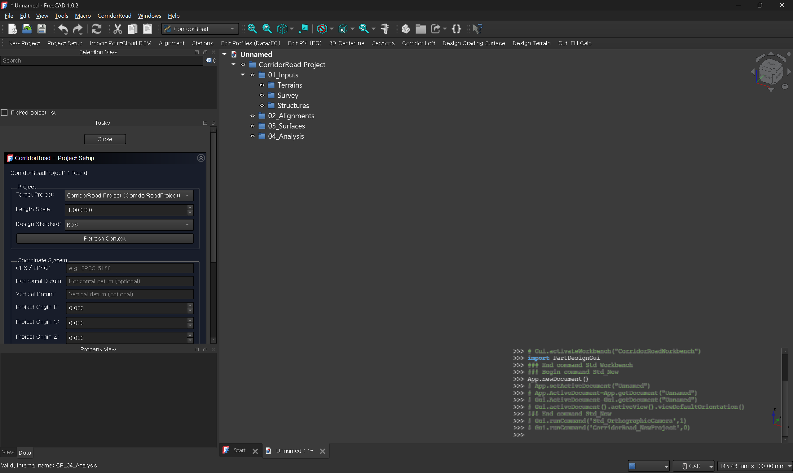
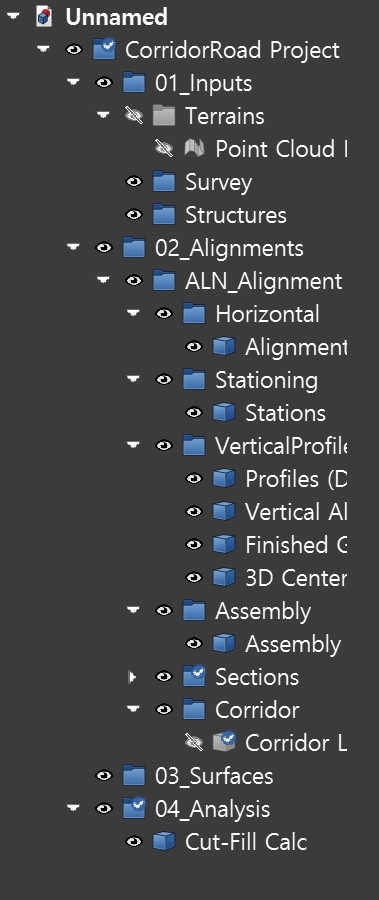

<!-- SPDX-License-Identifier: LGPL-2.1-or-later -->
<!-- SPDX-FileNotice: Part of the Corridor Road addon. -->

# CorridorRoad Wiki

CorridorRoad is a FreeCAD workbench for road corridor design.
This wiki is the practical guide for daily use and development.

## Start Here
- [Quick Start](Quick-Start)
- [Workflow](Workflow)
- [Menu Reference](Menu-Reference)
- [Screenshot Checklist](Screenshot-Checklist)
- [CSV Format](CSV-Format)
- [Troubleshooting](Troubleshooting)
- [Developer Guide](Developer-Guide)

## What You Can Do
- Build alignment/stations/profiles/sections/corridor in one pipeline.
- Import terrain from point cloud CSV using DEM-style grid sampling.
- Run design terrain and cut/fill analysis.
- Use project-level local/world coordinate transforms so world-coordinate inputs can be normalized into local engineering model space.
- Review a spline-based `3D Centerline` display while keeping station-based geometry as the engineering source of truth.

## Recommended First Test Data
- `tests/samples/pointcloud_utm_realistic_hilly.csv`
- `tests/samples/alignment_utm_realistic_hilly.csv`
- `tests/samples/structure_utm_realistic_hilly.csv`

Extended practical sample inventory:
- See [../PRACTICAL_SAMPLE_SET.md](../PRACTICAL_SAMPLE_SET.md) for the maintained starter CSV set, mixed practical scenarios, and sample-to-regression mapping.

Recommended first structure-aware test order:
1. Import the point cloud DEM sample.
2. Import the alignment sample.
3. Generate stations.
4. Load the structure sample in `Edit Structures`.
5. Generate sections and confirm `Structure Sections` appears in the alignment tree.

Practical validation note:
1. The maintained practical-engineering regression bundle is `tests/regression/run_practical_scope_smokes.ps1`.
2. Current long-term practical scope is centered on subassembly/report/surface-comparison workflows.
3. `boolean_cut` and release-readiness work are currently outside that focused roadmap scope.

## How To Use This Wiki
1. Start from [Quick Start](Quick-Start) for first successful run.
2. Use [Workflow](Workflow) when doing full production sequence.
3. Use [Menu Reference](Menu-Reference) when you need detailed meaning for task-panel options.
4. Use [Screenshot Checklist](Screenshot-Checklist) when preparing documentation images.
5. Use [CSV Format](CSV-Format) before importing external survey/alignment data.
6. Open [Troubleshooting](Troubleshooting) when EG/daylight/output issues appear.
7. Use [Developer Guide](Developer-Guide) for code-level changes.

## Questions And Support
- If users or developers have questions about CorridorRoad, please ask in the project thread on the FreeCAD Forum:
- https://forum.freecad.org/viewtopic.php?t=103783
- Use the forum thread for usage questions, bug discussion, and development feedback.

## Latest Release
- Current stable release: `v0.2.6`
- GitHub Release: https://github.com/ganadara135/CorridorRoad/releases/tag/v0.2.6

## Core Pipeline
`Terrain (EG) -> Alignment -> Stations -> Structures -> Profiles/PVI -> 3D Centerline -> Sections -> Corridor -> Design Terrain -> Cut/Fill`

## Screenshot Insertion Guide
1. Add image files under wiki repo path: `images/`.
2. Use relative markdown links: ``.
3. Keep width around 1600-2200 px for readability on wiki pages.

## Required Environment
- FreeCAD `1.0.2` or newer (recommended)
- Windows 11 (current validation environment)

## Notes
- Daylight terrain source in section workflow is mesh based.
- Runtime terrain/cut-fill sampling follows DEM-style regular XY grid.
- For coordinate-sensitive workflows, confirm Local/World mode before generation commands.
- Project Setup stores world origin, local origin, and north rotation so world-coordinate workflows can be converted back into local model space.
- `3D Centerline` is a display object; sections, structures, and corridor generation still evaluate the underlying station-based alignment/profile model.
- The recent visible zig-zag / wiggly 3D centerline issue was addressed on the display side by replacing the old polyline-style visible wire with a spline-based visible wire.
- Structure section overlays are shown in a separate `Structure Sections` tree folder so section display stays corridor-safe.
- `GeometryMode=external_shape` currently improves realistic structure display/reference placement, but earthwork still follows structure `Type`-based rules.
- The maintained practical sample inventory lives in `docs/PRACTICAL_SAMPLE_SET.md`.

---
Last verified with commit: `61ba6d5`
