<!-- SPDX-License-Identifier: LGPL-2.1-or-later -->
<!-- SPDX-FileNotice: Part of the Corridor Road addon. -->

# Workflow

This page describes the standard end-to-end CorridorRoad workflow.

For field-by-field explanations of task-panel options, see [Menu Reference](Menu-Reference).

## 1. Project Initialization
1. `New Project`
2. `Project Setup`
3. If `CRS / EPSG` is set, keep the recommended default `Coordinate Workflow = World-first`.
4. If the project is a local test/concept model with no real-world CRS, keep `Coordinate Workflow = Local-first`.
5. Use the editable `CRS / EPSG` preset combo when a built-in code matches your project, or type a custom EPSG code directly when needed.

Output:
- Fixed project tree
- Design standard and coordinate setup

Validation:
- Project object links are initialized.
- Length scale and coordinate policy are confirmed before geometry creation.
- Downstream task panels start from the same recommended coordinate mode when auto-apply is enabled.

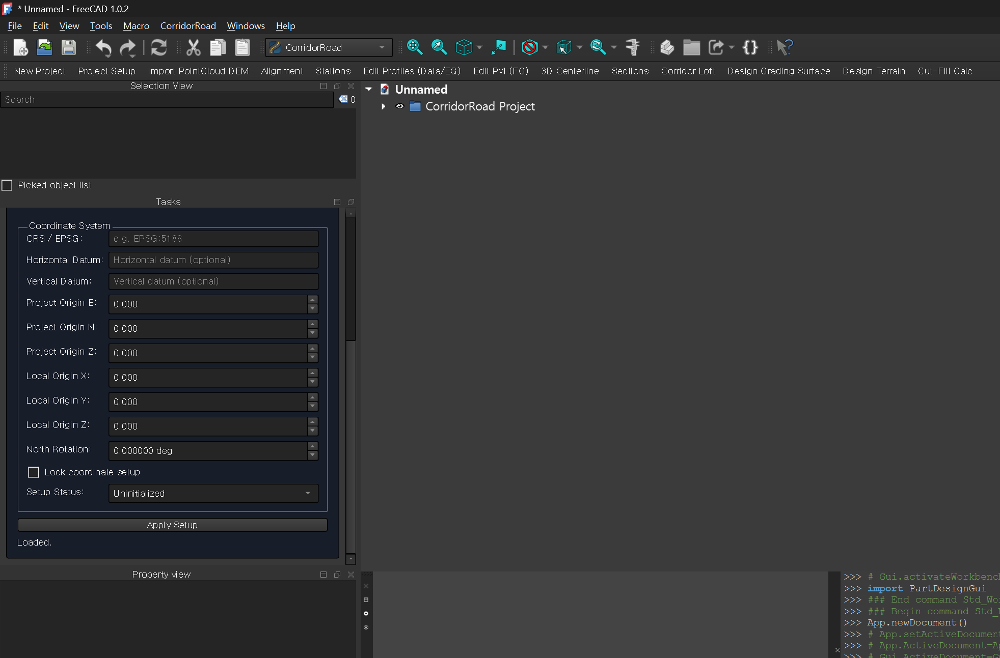

## 2. Existing Terrain (EG)
1. Run `PointCloud DEM`.
2. Load point cloud CSV (UTM or project coordinates).
3. Generate DEM mesh terrain.

Output:
- Mesh terrain object for EG sampling and daylight reference

Validation:
- Terrain mesh has valid facets.
- Terrain coverage encloses the intended alignment area.

DEM tuning note:
1. If EG/profile values later appear as blank or `0` at many stations, rebuild the terrain with a larger DEM `CellSize`.
2. A larger `CellSize` can reduce holes and weak coverage when the source point cloud is sparse.
3. Do not increase it too aggressively, because very large cells will smooth out real terrain variation.

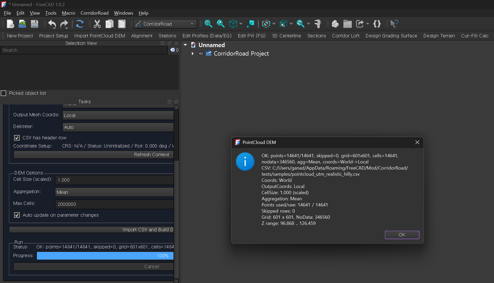
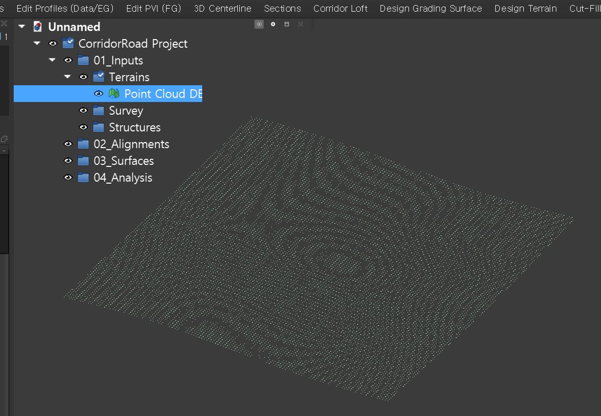

## 3. Horizontal Geometry
1. Open `Alignment`.
2. Import CSV, load a built-in `Preset`, or edit the table directly (IP, radius, transition).
3. Presets are stored as local-pattern rows.
4. `Preset Placement` defaults to `Center on terrain`, so starter geometry is usually moved into the current terrain extent automatically.
5. If `Coord Input` is currently `World (E/N)`, `Load Preset` converts those local rows through the active `Project Setup`.
6. Apply alignment.

Output:
- Horizontal alignment with key stations

Validation:
- IP/radius/transition interpretation is correct.
- Alignment path is inside terrain bounds.
- If a preset was used in `World` mode, the loaded coordinates should still fall inside terrain coverage and match the project origin/rotation policy.

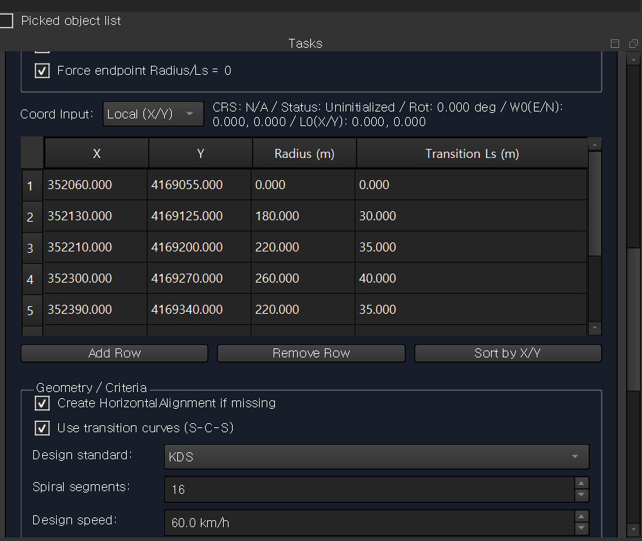
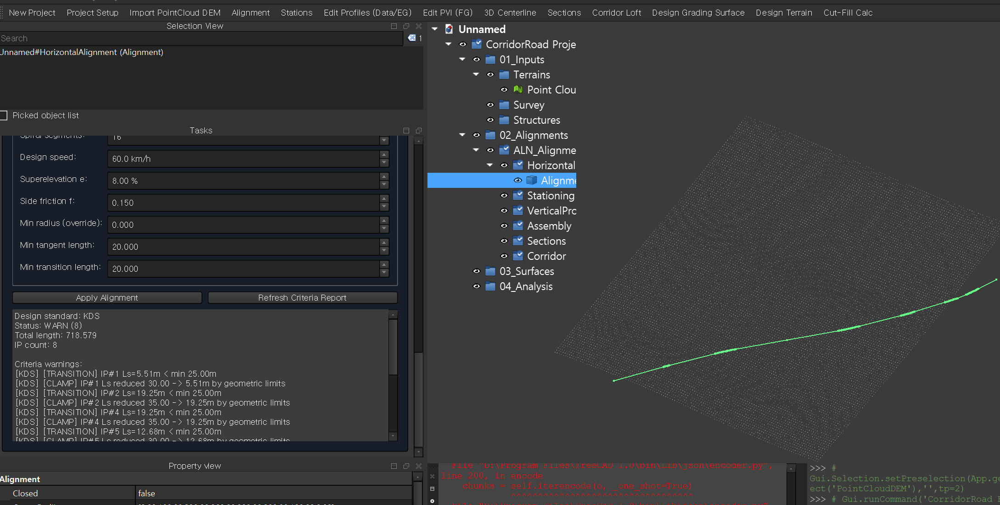

## 4. Stations and Profiles
1. `Generate Stations`
2. `Edit Profiles` for EG/FG data
3. `Edit PVI` for FG vertical geometry (optional)
4. Or use `Edit Profiles -> Import FG CSV` / `FG Wizard` for a manual FG starting point

Output:
- Stationing object
- Profile bundle and/or vertical alignment

Validation:
- Station list count is reasonable for interval.
- EG fill coverage is acceptable before FG generation.
- Manual FG import can start from either `Station,FG` or alias headers such as `PK,DesignElevation`.

Recommended manual FG sample files:
- `tests/samples/profile_fg_manual_import_basic.csv`
- `tests/samples/profile_fg_manual_import_aliases.csv`

If profile EG contains many blanks or `0` values:
1. Check whether the alignment is fully inside DEM coverage.
2. Check whether the source point cloud is too sparse for the current DEM `CellSize`.
3. Rebuild the DEM terrain with a larger `CellSize`, then regenerate stations/profiles.

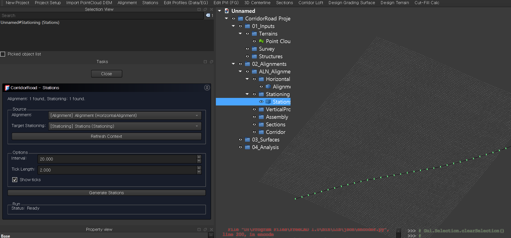
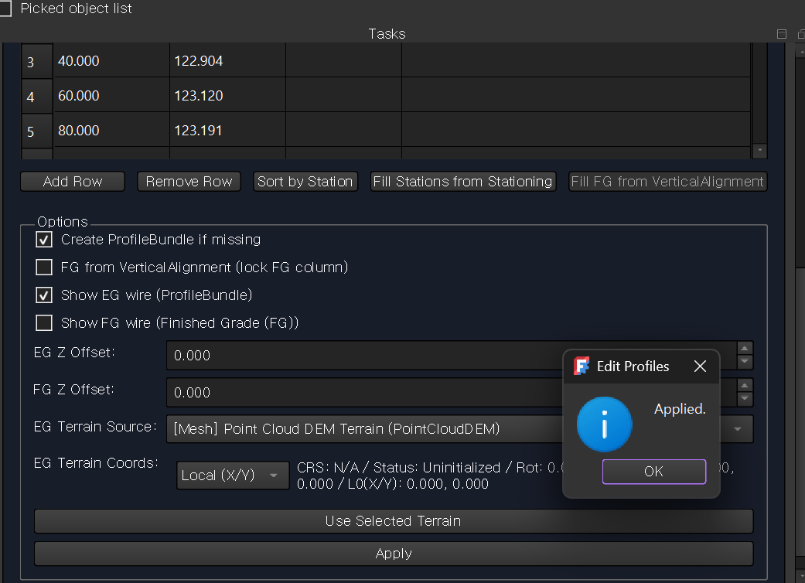
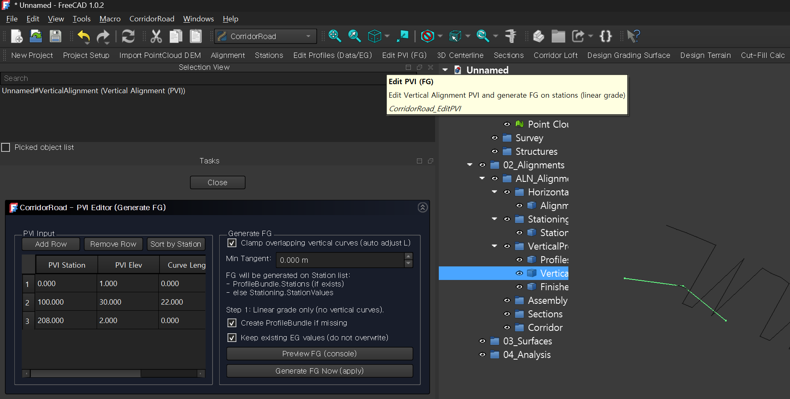

## 4A. Structures
1. Run `Edit Structures` after `Generate Stations`.
2. Load a structure CSV or enter rows manually.
3. Use the compact upper table for overview, and use `Selected Structure Details` for advanced fields.
4. If needed, use `Columns: Template / External Shape / Advanced` to temporarily reveal grouped columns in the upper table.
5. Use `Add Common Structure`, `Clone Selected`, or `Preset -> Load Preset` when you want to build a starter structure set quickly.
6. Use `Profile Preset -> Load Profile Preset` when the selected structure needs starter station-control points without preparing a separate profile CSV.
7. Apply the `StructureSet`.
8. If you already have profile/centerline data, run `3D Centerline` first or re-run it before re-applying structures so 3D placement uses the latest centerline frame.

Recommended sample:
- `tests/samples/structure_utm_realistic_hilly.csv`
- `tests/samples/structure_utm_realistic_hilly_notch.csv`
- `tests/samples/structure_utm_realistic_hilly_template.csv`
- `tests/samples/structure_utm_realistic_hilly_external_shape.csv`
- `tests/samples/structure_utm_realistic_hilly_station_profile_headers.csv`
- `tests/samples/structure_utm_realistic_hilly_station_profile_points.csv`
- `tests/samples/structure_utm_realistic_hilly_mixed.csv`
- `tests/samples/structure_utm_realistic_hilly_mixed_profile_points.csv`
- See [../PRACTICAL_SAMPLE_SET.md](../PRACTICAL_SAMPLE_SET.md) for the maintained practical scenario bundles.

Output:
- `StructureSet` under `01_Inputs/Structures`
- simple 3D structure solids

Validation:
- Structure rows use valid `Type`, `Side`, and `BehaviorMode`.
- Start/end/center stations match generated stationing policy.
- 3D structure solids appear inside the corridor area.
- For `external_shape`, replace placeholder `ShapeSourcePath` values with your own local `.step`, `.brep`, or `.FCStd#ObjectName` sources before applying.
- For `FCStd`, the expected form is `C:/path/model.FCStd#ObjectName`.
- For `FCStd`, the easiest workflow is `Browse Shape` -> `Pick FCStd Object`.
- If `Apply` reports `frame source=alignment`, re-run `3D Centerline` and apply the structure set again.
- If you are testing station-profile-driven structures, load the base structure CSV first, then use `Load Profile CSV`.
- The lower station-profile table follows the currently selected structure row in the upper table.
- The lower station-profile table now also supports `Sort by Station`, `Duplicate Profile Row`, `Add Midpoint`, and `Delete All for Selected`.
- The `Profile Preset` line above the lower table can generate starter variable-size control points directly from the selected structure span.
- The validation summary at the bottom now gives a quick `OK / warning / error` view before you apply.

![Screenshot Needed] Edit Structures task panel with station combo boxes and sample rows.
> Suggested file: `wiki-workflow-04a-structures-editor.png`

## 4B. Typical Section
1. Run `Typical Section`.
2. Either choose a built-in `Preset`, use the quick-add buttons (`Add Lane`, `Add Shoulder`, `Add Curb`, `Add Ditch`, `Add Berm`), or load rows with `Browse CSV` -> `Load CSV`.
3. If the section is symmetric, use `Mirror Left -> Right` or `Mirror Right -> Left` to copy edge rows quickly.
4. Use `Move Up`, `Move Down`, or `Sort by Order` to clean up the component order.
5. Optionally load pavement layers with either `Preset -> Load Pavement Preset` or `Browse Pavement CSV` -> `Load Pavement CSV`.
6. Check the `Summary` panel for top width, edge types, and pavement total thickness.
7. Click `Apply`.

Recommended sample files:
- `tests/samples/typical_section_basic_rural.csv`
- `tests/samples/typical_section_urban_complete_street.csv`
- `tests/samples/typical_section_with_ditch.csv`
- `tests/samples/typical_section_pavement_basic.csv`
- The maintained practical sample inventory is [../PRACTICAL_SAMPLE_SET.md](../PRACTICAL_SAMPLE_SET.md).

Current output:
- `TypicalSectionTemplate` object under the alignment `Assembly` branch
- preview wire showing the current top-profile composition

Current notes:
1. `TypicalSectionTemplate` defines the finished-grade top profile.
2. `AssemblyTemplate` still provides corridor depth, side slopes, and daylight defaults.
3. `ditch`, `curb`, and `berm` now affect the preview profile with dedicated break behavior.
4. Current component CSVs now use `ExtraWidth` and `BackSlopePct` in addition to the earlier width/slope/height fields.
4. Pavement layers can be loaded separately with `Browse Pavement CSV` -> `Load Pavement CSV`.
5. The editor now supports `Save Component CSV` and `Save Pavement CSV` so edited templates can be reused.
6. Type-aware tooltips and field tinting help show whether `CrossSlopePct` or `Height` matters more for the selected component.
7. Pavement totals are stored on the template as `PavementTotalThickness`.
8. Pavement preview offset wires were removed, so reopening the panel and applying the template should stay lighter than before.

![Screenshot Needed] StructureSet visible in 3D view and input tree.
> Suggested file: `wiki-workflow-04a-structures-3d.png`

## 5. 3D Centerline
1. Run `3D Centerline`.
2. In the task panel, confirm the source links:
   - `Alignment`
   - optional `Stationing`
   - optional `Vertical Alignment` / `ProfileBundle`
   - optional `RegionPlan`
   - optional `StructureSet`
3. If you want the display wire to break at semantic boundaries, keep region/structure split toggles enabled.
4. Choose `Display Quality` first for normal review work.
5. Adjust `Max Chord Error`, `Min Step`, and `Max Step` only when you need manual display tuning.
6. Click `Build 3D Centerline Display`.
7. Confirm sampled station count and wire in 3D view.

Output:
- Centerline3D display object

Validation:
- Completion popup appears.
- Sampled station count is non-zero and wire is visible.
- Task panel status reports the current display quality and sampling summary.
- If semantic split is enabled, split-source summary reflects region/structure boundaries and transitions.

[3D centerline wire and completion popup](images/wiki-workflow-05-centerline3d.png)

## 5A. Region Plan
1. Run `Manage Regions`.
2. Create or select the alignment-owned `RegionPlan`.
3. Define `Base Regions` first so the main corridor span layout is clear.
4. Add `Overrides` for local ditch/urban/corridor behaviors only where needed.
5. Use `Seed From Project` to refresh managed `Hints` from project, typical-section, structure, or design-standard context.
6. Review `Hints` and use `Accept`, `Accept and Edit`, or `Ignore`.
7. Use `Station Timeline` to confirm span order and final station ranges before section generation.

Output:
- `RegionPlan` under `02_Alignments/<Alignment>/Regions`
- grouped base / override / hint authoring data

Validation:
- Base spans cover the intended corridor regime without accidental overlap.
- Accepted hints become deterministic overrides; ignored hints remain traceable.
- `Station Timeline` reflects the intended station order before `Generate Sections`.
- In dark theme, grouped tables and timeline rows should remain readable with tinted rows and visible cell text.

## 6. Sections
1. Run `Generate Sections`.
2. Choose mode (`Range` or `Manual`).
3. If region spans should drive extra stations or section overrides, enable `Use linked Region Plan`.
4. If structures should drive extra stations, enable `Use linked StructureSet`.
5. If the finished-grade top profile should come from `Typical Section`, enable `Use Typical Section Template` and choose the source.
6. Configure daylight options if needed.
7. If cut/fill terraces are needed, turn on `Use Left Bench` / `Use Right Bench` and edit the `Bench Rows` tables directly.
8. Click `Generate Sections Now`.

Output:
- SectionSet with resolved station list and optional child sections
- `Structure Sections` folder with structure overlay objects at matching stations

Validation:
- Resolved station count matches mode/configuration.
- `Region Plan` boundary/transition stations are present when region integration is enabled.
- Daylight terrain is assigned when Daylight Auto is enabled.
- `Merged structure stations` is non-zero when structure records are inside range.
- `Structure Sections` objects appear only at relevant stations and do not break Corridor.
- When station-profile data exists, overlay size can change from one structure section station to the next.
- When a typical section is active, `SectionSet` should report `schema=2` and `topProfile=typical_section`.
- When pavement layers are loaded, `SectionSet` should also report a non-zero `PavementTotalThickness`.

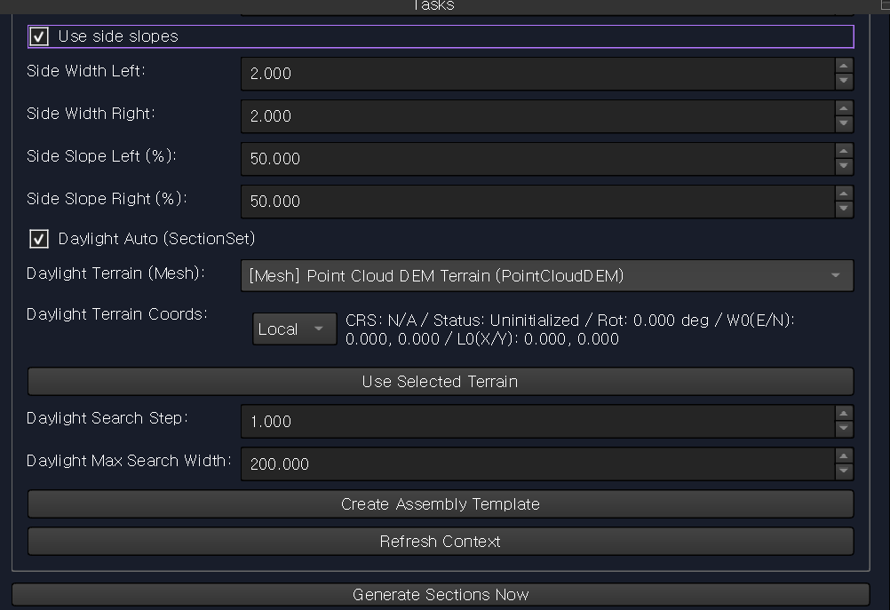
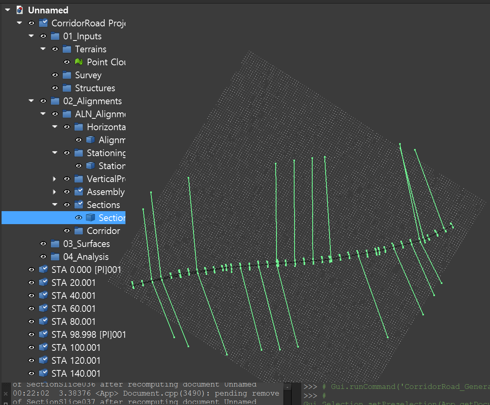

## 7. Corridor and Surfaces
1. Run `Corridor`.
2. Optionally run `Generate Design Grading Surface`.
3. Optionally run `Generate Design Terrain`.
4. Run `Generate Cut/Fill Calc`.

Output:
- Corridor surface
- Design terrain mesh
- Cut/fill summary

Validation:
- Corridor status is OK.
- Completion dialog shows `Source section schema`, `Top profile source`, and `Points per section`.
- When pavement layers are loaded, completion dialog also shows `Pavement total thickness`.
- Design terrain/cut-fill status fields show no blocking error.

Object intent:
- `Design Grading Surface` is the section-faithful reference surface. Use it when you want to verify that generated section lines are being connected exactly as expected.
- `Corridor` is the corridor result object. It must keep corridor span meaning such as skipped ranges, split structure zones, and notch-aware ranges, so it is the downstream `Part Shape` rather than a pure display mesh.
- These two objects should follow the same section contract, but they are not interchangeable in project role.

Quick comparison:
- `Corridor`: best when the project needs a range-aware corridor result object.
- `Design Grading Surface`: best when the project needs the clearest section-to-section reference surface.

Connectivity note:
- `Design Grading Surface` is the reference for raw section-to-section connectivity.
- `Corridor` should follow the same ordered section-point contract, then add corridor span packaging such as split, skip, and notch-aware ranges.
- If the two outputs disagree, treat that as a bug or packaging drift, not as two equally valid interpretations of the same sections.

## 7A. How To Reduce Corridor Twisting

Corridor twisting usually happens when neighboring sections change too abruptly or when section left/right orientation becomes inconsistent between stations.

Recommended settings and workflow:
1. Keep section spacing practical.
2. Avoid very small section interval unless the geometry truly needs it.
3. Increase `Corridor > Min Section Spacing` if many sections are nearly overlapping.
4. Turn on `Use ruled surface` first when testing unstable geometry.
5. Keep `Auto-fix flipped sections` enabled in Corridor.
6. If structures are present, keep `Split at structure zones` enabled.

Daylight-related guidance:
1. If `Daylight Auto` is enabled, avoid large jumps in daylight width between neighboring sections.
2. Use `Daylight Max Width Delta` in the Sections panel to smooth daylight-width changes.
3. If terrain is noisy or sparse, reduce dependence on aggressive daylight behavior until the base corridor is stable.

Profile and section quality guidance:
1. Check that EG/FG/profile data does not contain large zero-value runs or unexpected spikes.
2. Confirm the alignment stays inside terrain coverage.
3. Review child sections in the tree to find the first station where the shape looks reversed or jumps sharply.

Practical order of stabilization:
1. Increase section interval slightly.
2. Increase `Min Section Spacing`.
3. Enable `Use ruled surface`.
4. Keep `Auto-fix flipped sections` enabled.
5. Reduce daylight aggressiveness with `Daylight Max Width Delta`.

What the current code already does:
1. Stabilizes section normal continuity across stations.
2. Smooths daylight width changes using `Daylight Max Width Delta`.
3. Auto-fixes likely flipped section orientation in Corridor when enabled.
4. Falls back to adaptive segmented corridor building if the full corridor build fails.
5. Can split the corridor into structure-aware segments at structure boundaries.

## 7B. Structure-Aware Section Behavior

When `Use linked StructureSet` is enabled, structure records participate in section generation in three ways:
1. Structure start/end/center stations can be merged into the section station list.
2. Transition stations can be added automatically before and after structure boundaries.
3. Child sections receive structure metadata such as IDs, types, and roles.
4. Separate overlay objects are created under `Structure Sections` so structure envelopes stay visible without changing the corridor input wire.
5. `Corridor` can now read per-structure `CorridorMode` values so selected structure spans can be omitted with `skip_zone` or built with a notch-aware closed-profile schema.
6. When station-profile control points exist, structure width/height-related values can vary by station and feed 3D structure display, `Structure Sections`, section override behavior, and corridor `notch` handling.

Structure placement diagnostics:
1. `Edit Structures > Apply` can report `Frame diagnostics`.
2. `frame source=centerline3d` means the 3D structure used the 3D centerline frame as intended.
3. `frame source=alignment` means the structure fell back to the horizontal alignment frame.

Current override policy by structure type:
1. `culvert`, `crossing`
   - Affect both sides of the section.
   - Daylight is disabled through the structure zone.
   - Both sides are converted to short flat berm-like segments so the section still reads as a constrained crossing zone without breaking corridor stability.
2. `retaining_wall`
   - Affects the declared side only (`left` or `right`).
   - The wall side is converted to a short steep wall-like segment.
   - The opposite side can still keep its normal daylight behavior.
3. `bridge_zone`, `abutment_zone`
   - Affect both sides of the section conservatively.
   - Daylight is disabled through the active zone.
   - Both sides are trimmed back rather than flattened completely, so the section shape changes less abruptly but still remains corridor-safe.
4. `tag_only`
   - Adds structure station context and overlay labeling only.
   - Does not change the built section wire.

Practical recommendation:
1. Start with `tag_only` if you only need structure-aware stations.
2. Use `section_overlay` when you want sections and overlays to show the structure envelope.
3. Use `assembly_override` only when the corridor shoulder/daylight should be constrained around the structure zone.
4. Keep `Auto transition distance` enabled first; turn it off only if you need one manually fixed transition distance for every structure.
5. Use `CorridorMode=skip_zone` for culvert or abutment spans only when the corridor body should truly be absent across that zone.
6. Use `CorridorMode=notch` when you want the corridor to remain continuous but still receive a structure-aware recess through the active span. The current implementation is mainly intended for `culvert` and `crossing`, and it ramps the notch using transition stations.
7. Simple recommended mapping for users:
   - `culvert`, `crossing` -> `notch`
   - `bridge_zone`, `abutment_zone` -> `skip_zone`
   - `retaining_wall` -> `split_only`

Template structure display:
1. `Edit Structures` now supports `GeometryMode=box|template`.
2. Current templates are `box_culvert` and `retaining_wall`.
3. Template mode currently improves:
   - 3D structure display
   - `Structure Sections` overlay shape
4. Template mode does not yet mean full corridor boolean consumption.
5. Use `tests/samples/structure_utm_realistic_hilly_template.csv` when you want to test the current template workflow directly.

External-shape earthwork note:
1. `GeometryMode=external_shape` is currently a display/reference plus proxy-earthwork workflow.
2. `Sections`, `Design Grading Surface`, and `Corridor` still use type-based rules for earthwork.
3. Current status wording may report `earthwork=external_shape_proxy` when the loaded external shape contributes width/height proxy values.
4. Use `external_shape` when you need realistic structure appearance and placement, but do not expect the imported STEP/BREP/FCStd solid to define the actual earthwork cut shape yet.
5. Current type-driven earthwork intent is:
   - `culvert`, `crossing` -> notch / flat berm-style crossing rules
   - `retaining_wall` -> one-side retaining-wall rule
   - `bridge_zone`, `abutment_zone` -> trim / split / skip zone rules

Current notch policy:
1. `culvert` and `crossing` can switch the corridor to a notch-aware closed-profile schema.
2. notch depth and width are reduced automatically near `transition_before` and `transition_after`, then reach full effect inside the active span.
3. result reporting now exposes both `Notch-aware stations` and `Closed profile schema`.
4. `bridge_zone`, `abutment_zone`, and `retaining_wall` are still better handled with `skip_zone` or `split_only`.

Auto transition distance intent:
1. `retaining_wall` usually gets a shorter transition because it commonly affects one side only.
2. `culvert` and `crossing` get a moderate transition so both-side section change stays stable.
3. `bridge_zone` and `abutment_zone` get a longer transition because the influence zone is typically broader and more conservative.
4. If the structure boundary still looks too sharp, keep auto mode on and increase the structure width/height values only if those values are actually under-represented.

> [Screenshot Needed] Sections panel with `Use linked StructureSet` and structure integration options enabled.
> Suggested file: `wiki-workflow-07c-structure-sections-options.png`

> [Screenshot Needed] Alignment tree showing both `Sections` and `Structure Sections`.
> Suggested file: `wiki-workflow-07d-structure-sections-tree.png`

> [Screenshot Needed] Corridor options showing `Min Section Spacing`, `Use ruled surface`, and `Auto-fix flipped sections`.
> Suggested file: `wiki-workflow-07a-corridor-loft-stability-options.png`

> [Screenshot Needed] Corridor options showing `Split at structure zones` and status with `structureSegs`.
> Suggested file: `wiki-workflow-07e-corridor-loft-structure-split.png`

> [Screenshot Needed] Sections options showing `Daylight Max Width Delta`.
> Suggested file: `wiki-workflow-07b-daylight-max-width-delta.png`

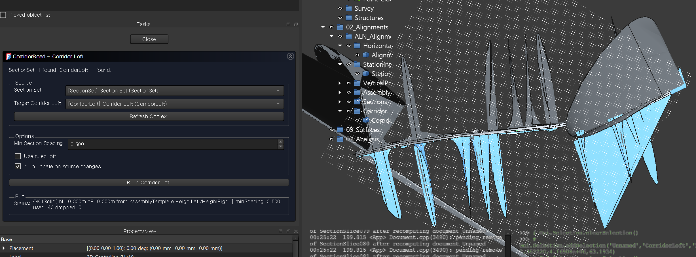
- this is a failed case. check your profile data. there would be many zero data.
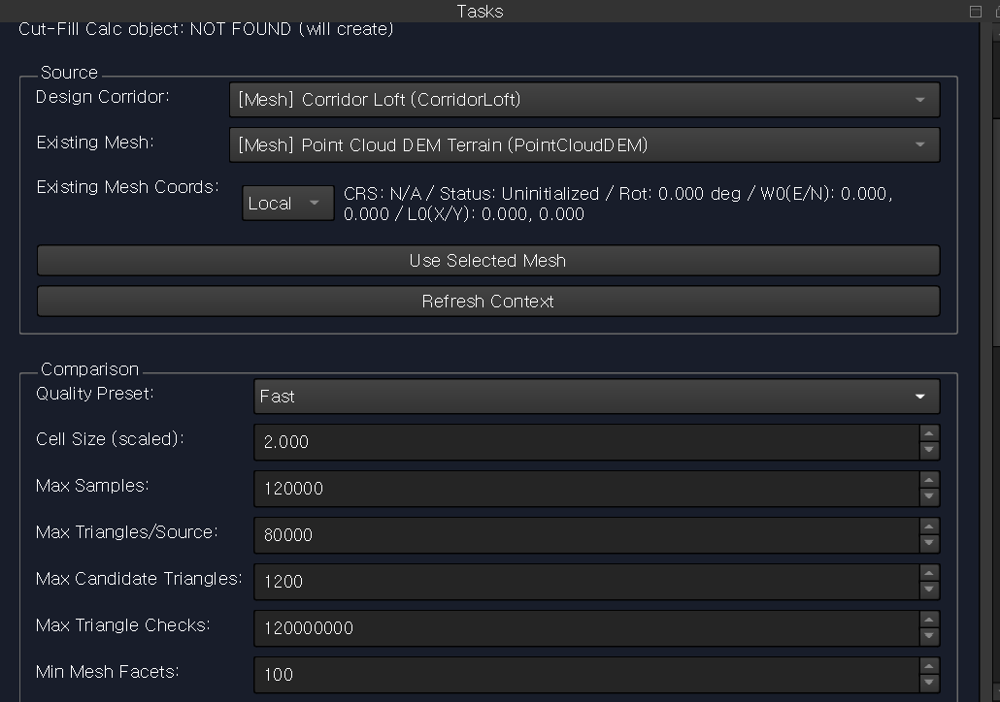
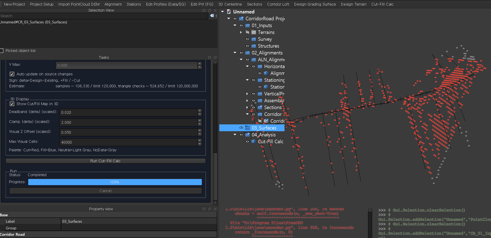

## 8. Quality Check
- Verify station coverage and EG values.
- Verify accepted `RegionPlan` overrides and boundary stations are reflected in generated sections.
- Verify daylight intersections where required.
- Check status fields for warnings/errors on generated objects.
- Re-run failed stages after fixing source links or coordinate mode.
- For the maintained Long-Term practical bundle, run `tests/regression/run_practical_scope_smokes.ps1`.

---
Last verified with commit: `61ba6d5`
